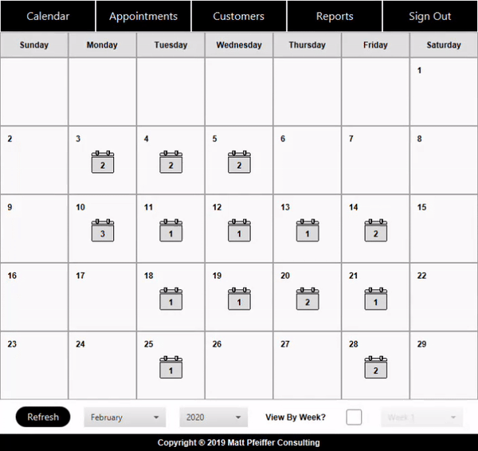
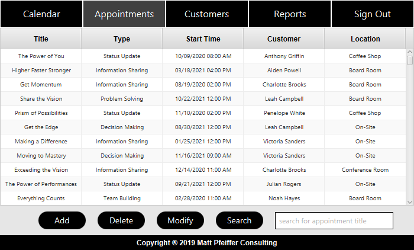
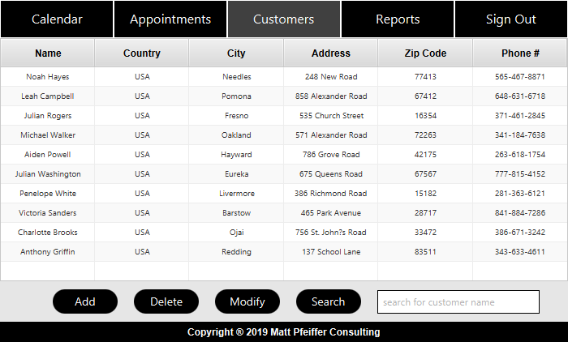
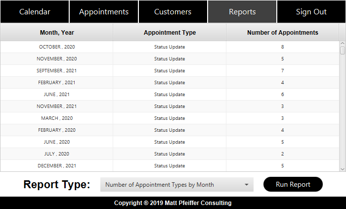

<h1 id="top"> Consulting Schedule Application </h1>

Java application for scheduling appointments with customers. 

<h1 id="index"> Index </h1>
 <ol type="i">
   <li><a href="#features">Features</a></li>
   <li><a href="#sign_in_screen">Sign In Screen</a></li>
   <li><a href="#main_screen">Main Screen</a></li>
   <li><a href="#calendar">Calendar</a></li>
   <li><a href="#appointments_table">Appointments Table</a></li>
   <li><a href="#customers_table">Customers Table</a></li>
   <li><a href="#reports">Reports</a></li>
 </ol> 

<h1 id="features"> Features </h1> 

 <ol>
  <li>Sign in screen determines user's location and translates language (only available in english and french).</li>
  <li>Application can add, update, and delete customer and appointment records in a database.</li>
  <li>Provides a graphical calendar view of a consultants schedule by month or by week.</li>
  <li>All business logic is stored in UTC and all views are provided in local time (based on the users system clock).</li>
  <li>User is alerted if appointment is within 15 minutes of sign in.</li>
  <li>User data is stored by recording timestamps on log-in to a textfile.</li>
 </ol>
  

 <a href="#top">Back To Top</a>

<h1 id="sign_in_screen"> Sign In Screen </h1> 

  <kbd>
    
  </kbd>
    
  The Sign in window is shown on application launch.  
  A valid username and password must be provided in order to display the main application window.
     
  <kbd>
    
  </kbd>
    
  Error message pops up on invalid username/password combination.
    
  <a href="#top">Back To Top</a>
    

<h1 id="main_screen"> Main Screen </h1> 

  <kbd>
     
  </kbd>
   
 The calendar view is displayed first when the main screen is shown.
   
  <a href="#top">Back To Top</a>
    

<h1 id="calendar"> Calendar </h1> 

  <kbd>
     
  </kbd>
   
 The graphic on each day displays the number of appointments scheduled for the consultant.  
 The month and year can be selected below the calendar.  
   
 

 

 
  <kbd>
    
  </kbd>
   
  Clicking on the appointment graphic inside a day displays more information about the appointments.
    
  <a href="#top">Back To Top</a>
    

<h1 id="appointments_table"> Appointments Table </h1> 

  <kbd>
    
  </kbd>
   
  The appointments table view displays all of the appointments for a consultant.
    
  <a href="#top">Back To Top</a>

<h1> Modify Appointment </h1> 

  <kbd>
    
  </kbd>
   
  Appointments are added or modified from the add/modify appointment window.
    
  <a href="#top">Back To Top</a>
    

<h1 id="customers_table"> Customers Table </h1> 

  <kbd>
    
  </kbd>
   
  The customers table view displays all of the appointments for a consultant.
    
  <a href="#top">Back To Top</a>
    

<h1> Modify Customer </h1> 

  <kbd>
    
  </kbd>
   
  Customers are added or modified from the add/modify customer window.
    
  <a href="#top">Back To Top</a>
    

<h1 id="reports"> Reports </h1> 

  <kbd>
    
  </kbd>
   
 The reports table view displays the number of each appointment type broken up by month.  
 Additional reports are available that show the schedule and total the number of hours for each consultant.
    
  <a href="#top">Back To Top</a>
    

