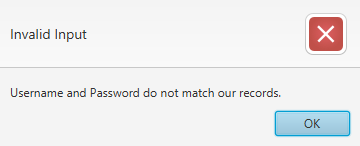
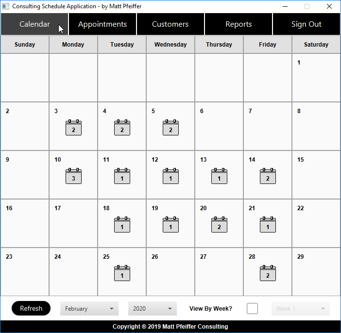
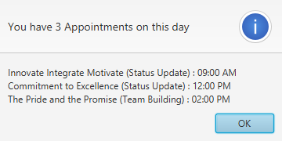
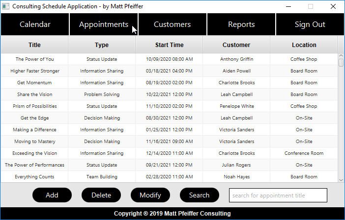
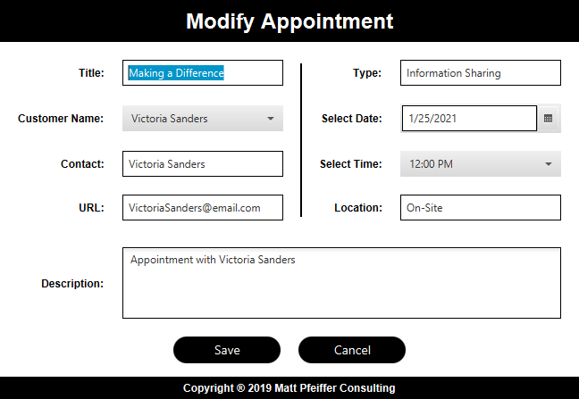
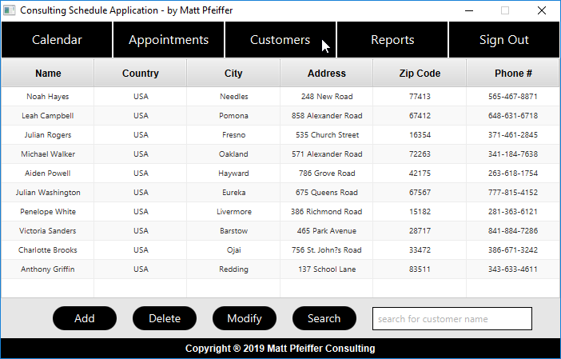
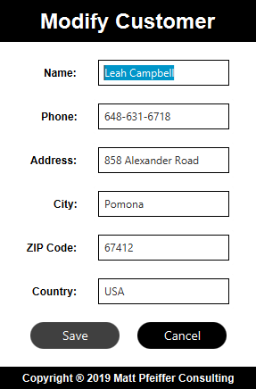
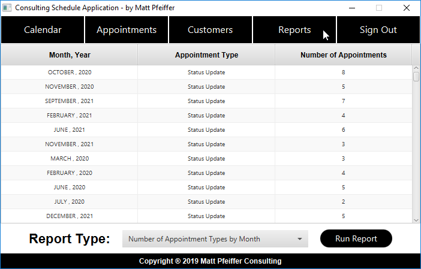

<h1 id="top"> Consulting Schedule Application </h1>

Java application for scheduling appointments with customers. 

<h1 id="index"> Index </h1>
 <ol type="i">
   <li><a href="#features">Features</a></li>
   <li><a href="#sign_in_screen">Sign In Screen</a></li>
   <li><a href="#calendar">Calendar</a></li>
   <li><a href="#appointments_table">Appointments Table</a></li>
   <li><a href="#customers_table">Customers Table</a></li>
   <li><a href="#reports">Reports</a></li>
 </ol> 

<h1 id="features"> Features </h1> 

 <ol>
  <li>All data is stored in a database and previous data is loaded on sign in.</li>
  <li>All business logic is stored in UTC and all views are provided in local time (based on the users system clock)</li>
 </ol>
  
 <a href="#top">Back To Top</a>

<h1 id="sign_in_screen"> Sign In Screen </h1> 

  <kbd>
    
  </kbd>
    
  The Sign in window is shown on application launch.  
  A valid username and password must be provided in order to display the main application window.
     
  <kbd>
    
  </kbd>
    
  This error message pops up on invalid username/password combination.
    
  <a href="#top">Back To Top</a>
    

<h1 id="calendar"> Calendar </h1> 

  <kbd>
     
  </kbd>
   
 The calendar view is displayed first when the main screen is shown.  
 The graphic on each day displays the number of appointments scheduled for the consultant.  
 The month and year can be selected below the calendar.  
   
 

 

 
  <kbd>
    
  </kbd>
   
  Clicking on the appointment graphic inside a day displays more information about the appointments.  
    
  <a href="#top">Back To Top</a>
    

<h1 id="appointments_table"> Appointments Table </h1> 

  <kbd>
    
  </kbd>
   
  The .  
    
  <a href="#top">Back To Top</a>

<h1> Modify Appointment </h1> 

  <kbd>
    
  </kbd>
  
  <a href="#top">Back To Top</a>
    

<h1 id="customers_table"> Customers Table </h1> 

  <kbd>
    
  </kbd>
  
  <a href="#top">Back To Top</a>
    

<h1> Modify Customer </h1> 

  <kbd>
    
  </kbd>
  
  <a href="#top">Back To Top</a>
    

<h1 id="reports"> Reports </h1> 

  <kbd>
    
  </kbd>
  
  <a href="#top">Back To Top</a>
    

