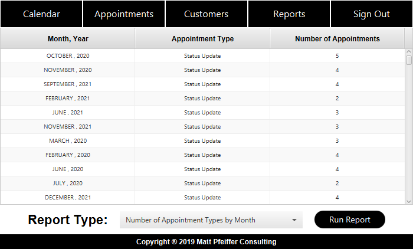

# ConsultingSchedule

Java application for scheduling appointments with customers. 

<h1 id="index"> Index </h1> 
 <ol type="i">
   <li><a href="#sign_in_screen">Sign In Screen</a></li>
   <li><a href="#calendar">Calendar</a></li>
   <li><a href="#appointments_table">Appointments Table</a></li>
   <li><a href="#customers_table">Customers Table</a></li>
   <li><a href="#reports">Reports</a></li>
 </ol> 

A couple notes:
1) All data is stored in a database and previous data is loaded on sign in.
2) All business logic is stored in UTC and all views are provided in local time (based on the users system clock)

<!--<!-- .element height="10%" width="10%" -->

<h1 id="sign_in_screen"> Sign In Screen </h1> 

  <kbd  >
    
  </kbd>

<h1 id="calendar"> Calendar </h1> 

  <kbd>
     
  </kbd>
  <kbd>
    
  </kbd>

<h1 id="appointments_table"> Appointments Table </h1> 

  <kbd>
    
  </kbd>

<h1> Modify Appointment </h1> 

  <kbd>
    
  </kbd>

<h1 id="customers_table"> Customers Table </h1> 

  <kbd>
    
  </kbd>

<h1> Modify Customer </h1> 

  <kbd>
    
  </kbd>

<h1 id="reports"> Reports </h1> 

  <kbd>
    
  </kbd>

